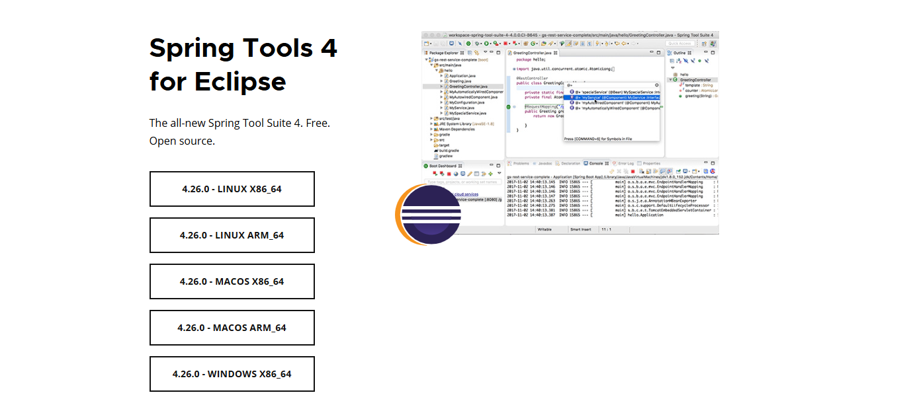
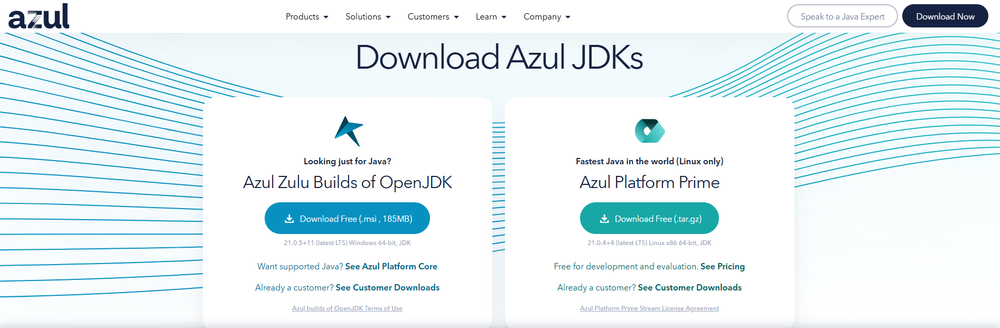
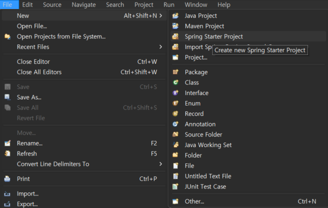
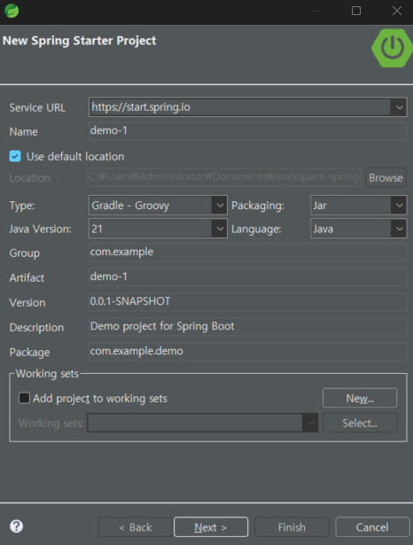
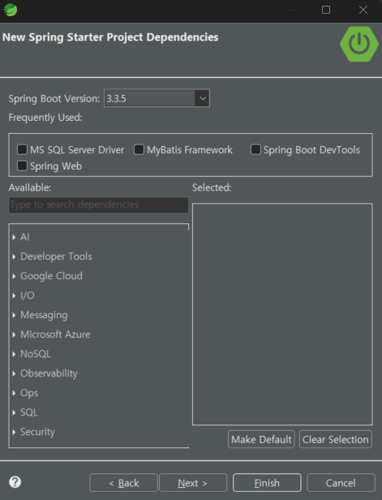
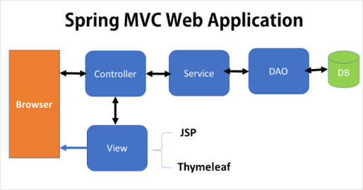
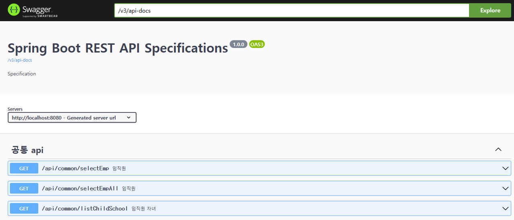

 # Spring Boot REST API 구성하기

 💡 STS 환경에서 MS-SQL DB를 연결하여 REST API를 구축하고, Swagger로 테스트하는 방법을 기술합니다. 

 ## 1. Spring vs Spring Boot
 - **Spring**
    - Java Application 개발을 위한 기본 프레임워크
    - XML 또는 Java로 복잡한 설정 필요
    - WAR(Web Application Archive) 파일을 Tomcat 같은 외부 웹 서버에 배포
 - **Spring Boot**
    - Spring을 쉽게 사용하게 해주는 도구
    - 많은 설정들이 자동으로 이루어짐
    - JAR(Java Archive) 파일을 실행하면 자동으로 내장된 서버(Tomcat, Jetty 등)가 실행

 ## 2. STS 설치
 - [Spring Tools 사이트](https://spring.io/tools) 접속 후 Spring Tools 4 for Eclipse 설치
  

 ## 3. Open JDK 설치
  - [azul 사이트](https://www.azul.com/downloads/?package=jdk#zulu) 접속 후 OpenJDK 설치 후 환경변수 설정  
  

 ## 4. SpringBoot 프로젝트 생성하기
  - File -> New -> Spring Starter Project 클릭
    
  - Type, Packaging, Java Version 설정 후 Next (Java Version = 설치한 JDK Version) 
    
  - Dependency 선택 후 Finist 
    
    - Spring BOot DevTools
    - Spring Web
    - Mybatis Framework
    - MS SQL Server Driver 

 ## 5. MVC 구조 이해하기
  - **DB** : 실제 데이터베이스 서버
    - Mybatis : 쿼리작성을 편하게 도와주는 프레임워크
  - **Model** : 데이터를 처리하는 영역
    - DAO : 데이터베이스에 접근하는 객체
    - DTO : 데이터를 전달하기 위한 객체
    - VO : 값 자체를 표현하는 객체
    - Entity : 실제 DB 테이블과 매핑되는 클래스
  - **Service** : Controller와 Model의 중간다리 역할
  - **Controller** : 클라리언트의 요청을 처리
  - **View** : 실제 사용자에게 보여지는 화면
    - View는 Controller에서 호출
    - Contoller에서 전달한 Model을 화면에서 사용할 수 있음
    - ajax : Javascript에서 XML로 비동기 통신하는 방법
    - JSP : HTML 코드에 Java 코드를 포함한 동적 웹페이지  

   

 ## 6. Model 생성하기
  - 📁 java\com\example\demo\ 경로에 model 패키지 생성 후 java 클래스 생성 및 변수 선언
  ```java
package com.example.demo.model;

public class EmpVo {
	private String UserId;
	private String DeptNm;
	private String UserNm;
	private String DutyNm;	
}

  ```
  - 생성 후 변수를 선언하고 해당 파일 우클릭 -> Source -> Generate Getters and Setters를 클릭하면 자동으로 Getter, Setter 생성
  ```java
package com.example.demo.model;

public class EmpVo {
	private String UserId;
	private String DeptNm;
	private String UserNm;
	private String DutyNm;
	
	public String getUserId() {
		return UserId;
	}
	public void setUserId(String userId) {
		UserId = userId;
	}
	public String getDeptNm() {
		return DeptNm;
	}
	public void setDeptNm(String deptNm) {
		DeptNm = deptNm;
	}
	public String getUserNm() {
		return UserNm;
	}
	public void setUserNm(String userNm) {
		UserNm = userNm;
	}
	public String getDutyNm() {
		return DutyNm;
	}
	public void setDutyNm(String dutyNm) {
		DutyNm = dutyNm;
	}
}
  ```

 ## 7. DB 연결하기
   - 📁 resources 경로에 mybatis 폴더 생성
   - resources/application.properties에서 DB연결정보를 설정
   ```xml
   spring.application.name=demo

spring.datasource.driverClassName=com.microsoft.sqlserver.jdbc.SQLServerDriver
spring.datasource.url=jdbc:sqlserver://{접속경로}:{포트};databaseName={DB명};encrypt=true;trustServerCertificate=true
spring.datasource.username={ID 입력}
spring.datasource.password={PW 입력}   

mybatis.mapper-locations=/mybatis/*.xml

   ```
   - mybatis 폴더에서 mapper.xml 생성하여 사용할 쿼리문 작성
   ``` java
   <?xml version="1.0" encoding="UTF-8"?>
<!DOCTYPE mapper PUBLIC "-//mybatis.org//DTD Mapper 3.0//EN" "http://mybatis.org/dtd/mybatis-3-mapper.dtd">

<mapper namespace="com.example.demo.dao.CommonRepository">
	<!--파라미터 없는 쿼리문-->
    <select id="selectEmpAll" resultType="com.example.demo.model.EmpVo">;
        SELECT UserId, DeptNm, UserNm, DutyNm
          FROM TCO_USER WITH(NOLOCK)                  
    </select>
    <!--파라미터 있는 쿼리문-->
    <select id="selectEmp" resultType="com.example.demo.model.EmpVo">;
        SELECT UserId, DeptNm, UserNm, DutyNm
          FROM TCO_USER WITH(NOLOCK)       
         WHERE UserNm LIKE '%' + #{name} + '%'           
    </select>
    <!--프로시저 파라미터 여러개-->
    <select id="listChildSchool" statementType="CALLABLE" parameterType="map" resultType="com.example.demo.model.ChildVo">
	    { call PHR_ChildSchool_ListChildSchool (#{empNo}, #{type}) }
	</select>
</mapper>
   ```

   - 📁 java\com\example\demo\ 경로에 dao 패키지 생성 후 class 추가
   ```java
   package com.example.demo.dao;

import java.util.List;
import com.example.demo.model.EmpVo;
import com.example.demo.model.ChildVo;
import org.apache.ibatis.annotations.Mapper;
import org.apache.ibatis.annotations.Param;

@Mapper
public interface CommonRepository {
	List<EmpVo> selectEmpAll() throws Exception;
	
	List<EmpVo> selectEmp(@Param("name") String name) throws Exception;
	
	List<ChildVo> listChildSchool(@Param("empNo") String empNo, @Param("type") String type) throws Exception;
}

   ```

 ## 8. Service 생성하기
   - 📁 java\com\example\demo\ 경로에 service 패키지 생성 후 class 추가
   ```java
   package com.example.demo.service;

import java.util.List;

import org.springframework.beans.factory.annotation.Autowired;
import org.springframework.stereotype.Service;

import com.example.demo.dao.CommonRepository;
import com.example.demo.model.ChildVo;
import com.example.demo.model.EmpVo;

@Service
public class CommonService {
	@Autowired
	CommonRepository commonRepository;
	
	public List<EmpVo> selectEmpAll() throws Exception{
		return commonRepository.selectEmpAll();
	}
	
	public List<EmpVo> selectEmp(String name) throws Exception{
		return commonRepository.selectEmp(name);
	}
	
	public List<ChildVo> listChildSchool(String empNo, String type) throws Exception{
		return commonRepository.listChildSchool(empNo, type);
	}
}
   ```

 ## 9. Controller 생성하기
  - 📁 java\com\example\demo\ 경로에 controller 패키지 생성 후 class 추가
 ```java
 package com.example.demo.controller;


import java.util.List;

import org.springframework.beans.factory.annotation.Autowired;
import org.springframework.web.bind.annotation.GetMapping;
import org.springframework.web.bind.annotation.RequestParam;
import org.springframework.web.bind.annotation.RestController;

import com.example.demo.model.EmpVo;
import com.example.demo.model.ChildVo;
import com.example.demo.service.CommonService;

@RestController
public class CommonController {
	@Autowired
	CommonService service;
	
	@GetMapping(("/api/common/selectEmpAll"))
	public Object[] selectEmpAll() throws Exception {
		List<EmpVo> empList = service.selectEmpAll();
		return empList.toArray();
	}
	
	@GetMapping(("/api/common/selectEmp"))
	public Object[] selectEmp(@RequestParam("name") String name) throws Exception {
		List<EmpVo> empList = service.selectEmp(name);
		return empList.toArray();
	}
	
	@GetMapping(("/api/common/listChildSchool"))
	public Object[] listChildSchool(@RequestParam("empNo") String empNo, @RequestParam("type") String type)
			throws Exception {
		List<ChildVo> childList = service.listChildSchool(empNo, type);
		return childList.toArray();
	}
}

 ```

 ## 10. Swagger 설정하기
   - build.gradle에서 `implementation 'org.springdoc:springdoc-openapi-starter-webmvc-ui:2.0.2'` 추가 (Spring Boot 3.0 이상)
   ```gradle
   dependencies {
	implementation 'org.springframework.boot:spring-boot-starter-web'
	implementation 'org.mybatis.spring.boot:mybatis-spring-boot-starter:3.0.3'
	implementation "org.mybatis:mybatis:3.4.5"
	developmentOnly 'org.springframework.boot:spring-boot-devtools'
	runtimeOnly 'com.microsoft.sqlserver:mssql-jdbc'
	testImplementation 'org.springframework.boot:spring-boot-starter-test'
	testImplementation 'org.mybatis.spring.boot:mybatis-spring-boot-starter-test:3.0.3'	
	testRuntimeOnly 'org.junit.platform:junit-platform-launcher'
	implementation 'org.springframework.boot:spring-boot-starter-jdbc'
	implementation 'org.springdoc:springdoc-openapi-starter-webmvc-ui:2.0.2'
}
   ```
  - 📁 java\com\example\demo\ 경로에 swagger 패키지 생성 후 class 생성
   ```java
   package com.example.demo.swagger;

import io.swagger.v3.oas.models.Components;
import io.swagger.v3.oas.models.OpenAPI;
import io.swagger.v3.oas.models.info.Info;
import org.springframework.context.annotation.Bean;
import org.springframework.context.annotation.Configuration;

@Configuration
public class SwaggerConfig {

    @Bean
    OpenAPI openAPI() {
        return new OpenAPI()
                .components(new Components())
                .info(apiInfo());
    }

    private Info apiInfo() {
        return new Info()
                .title("Spring Boot REST API Specifications")
                .description("Specification")
                .version("1.0.0");
    }
}

   ```
  - controller에서 @Tag와 @Operation을 활용하여 구분
  ```java
  package com.example.demo.controller;


import java.util.List;

import org.springframework.beans.factory.annotation.Autowired;
import org.springframework.web.bind.annotation.GetMapping;
import org.springframework.web.bind.annotation.RequestParam;
import org.springframework.web.bind.annotation.RestController;

import com.example.demo.model.EmpVo;
import com.example.demo.model.ChildVo;
import com.example.demo.service.CommonService;

import io.swagger.v3.oas.annotations.Operation;
import io.swagger.v3.oas.annotations.tags.Tag;

//Swagger : http://localhost:8080/swagger-ui/index.html

@Tag(name = "공통 api")
@RestController
public class CommonController {
	@Autowired
	CommonService service;
	
	@Operation(summary = "임직원",description = "임직원 전체 조회")
	@GetMapping(("/api/common/selectEmpAll"))
	public Object[] selectEmpAll() throws Exception {
		List<EmpVo> empList = service.selectEmpAll();
		return empList.toArray();
	}
	
	@Operation(summary = "임직원",description = "임직원 조회")
	@GetMapping(("/api/common/selectEmp"))
	public Object[] selectEmp(@RequestParam("name") String name) throws Exception {
		List<EmpVo> empList = service.selectEmp(name);
		return empList.toArray();
	}
	
	@Operation(summary = "임직원 자녀",description = "임직원 자녀 학교 조회")
	@GetMapping(("/api/common/listChildSchool"))
	public Object[] listChildSchool(@RequestParam("empNo") String empNo, @RequestParam("type") String type)
			throws Exception {
		List<ChildVo> childList = service.listChildSchool(empNo, type);
		return childList.toArray();
	}
}
  ```
  - http://localhost:8080/swagger-ui/index.html 경로로 접속하면 Swagger 사용 가능



